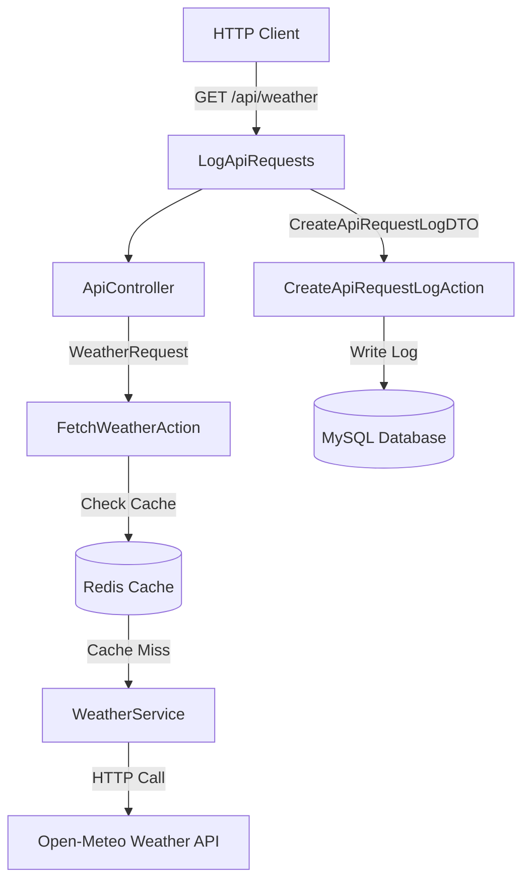

# Laravel 12 API Caching & Task Scheduling (DDD Refactored)

This project is a premium Laravel 12 application demonstrating **Domain-Driven Design (DDD)**, **Redis caching** of external APIs, **automatic database logging**, and **cron task scheduling**.

---

## Architecture Design (DDD)

The project structure separates domain logic into self-contained layers:



### Main Domain Layers

1. **Weather Domain (`App\Domain\Weather`)**
   - `DTOs\WeatherQueryDTO`: Carries longitude and latitude parameters.
   - `Requests\WeatherRequest`: Custom FormRequest class handling coordinates validation.
   - `Services\WeatherService`: Interacts with the external HTTP endpoint.
   - `Actions\FetchWeatherAction`: Coordinates caching logic and API calls.

2. **ApiLog Domain (`App\Domain\ApiLog`)**
   - `Models\ApiRequestLog`: Database representation for logs.
   - `DTOs\CreateApiRequestLogDTO`: Encapsulates logging data attributes.
   - `Actions\CreateApiRequestLogAction`: Saves request stats in the database.
   - `Actions\ClearOldLogsAction`: Handles scheduled cleanup of logs older than 30 days.

---

##  Prerequisites

Ensure you have the following installed on your machine:
- **PHP 8.2 or higher** (Ensure the `redis` extension is enabled in PHP)
- **Composer 2.0+**
- **Redis Server** (Default configuration running on `127.0.0.1:6379`)
- **MySQL** (Database Server, e.g. via Laragon, MySQL Workbench, or XAMPP)

---

## Setup & Installation Steps

### 1. Clone or Navigate to the Directory
Ensure you are operating in the project root:
```bash
cd c:\laragon\www\laravel12-api-scheduling-cache
```

### 2. Create the MySQL Database
You must create the database in MySQL before running migrations. Run this query inside your MySQL client (e.g., HeidiSQL, phpMyAdmin, or MySQL CLI):
```sql
CREATE DATABASE laravel12_api_scheduling;
```

### 3. Configure Environment Options
Double-check your database and cache settings in `.env`:
```env
DB_CONNECTION=mysql
DB_HOST=127.0.0.1
DB_PORT=3306
DB_DATABASE=laravel12_api_scheduling
DB_USERNAME=root
DB_PASSWORD=

CACHE_STORE=redis
REDIS_CLIENT=phpredis
REDIS_HOST=127.0.0.1
REDIS_PORT=6379
```

### 4. Run Database Migrations
Deploy the tables for jobs, cache, and request logs:
```bash
php artisan migrate
```

---

## 🚦 Running the Application

### 1. Start the Development Server
```bash
php artisan serve
```
The application will start running at: [http://127.0.0.1:8000](http://127.0.0.1:8000)

### 2. Testing the API Endpoint
Send a `GET` request to retrieve weather details:
```
GET http://127.0.0.1:8000/api/weather?latitude=52.52&longitude=13.41
```

- **First request**: The app calls the external weather endpoint, caches it in Redis, logs request attributes to the database, and returns:
  ```json
  {
      "success": true,
      "source": "external_api",
      "data": { ... }
  }
  ```
- **Second request** (within 1 hour): The response is retrieved instantly from Redis cache:
  ```json
  {
      "success": true,
      "source": "cache",
      "data": { ... }
  }
  ```

---

## 🛠️ Managing with Artisan Commands

We have created two customized Artisan commands to manually test the core features of the system:

### 1. Manually Query & Cache Weather
Query weather data for any coordinates and load it directly into Redis:
```bash
# Fetch and cache weather with default coordinates (Berlin)
php artisan api:fetch-weather

# Fetch weather for Tokyo and cache it
php artisan api:fetch-weather --latitude=35.67 --longitude=139.65

# Force refresh/bypass cache and download latest data immediately
php artisan api:fetch-weather --force
```

### 2. Prune Old Request Logs
Clear the database log records older than the given threshold:
```bash
# Deletes logs older than 30 days (default)
php artisan logs:clear-old

# Deletes logs older than 10 days
php artisan logs:clear-old 10
```

### 3. Run the Scheduler
To verify scheduler automation locally in development:
```bash
php artisan schedule:work
```

---

## 🧪 Testing the Suite
You can run automated feature and unit tests (database logging, cache invalidations, command operations) to confirm the code behaves correctly:
```bash
php artisan test --filter=ApiSchedulerCacheTest
```
